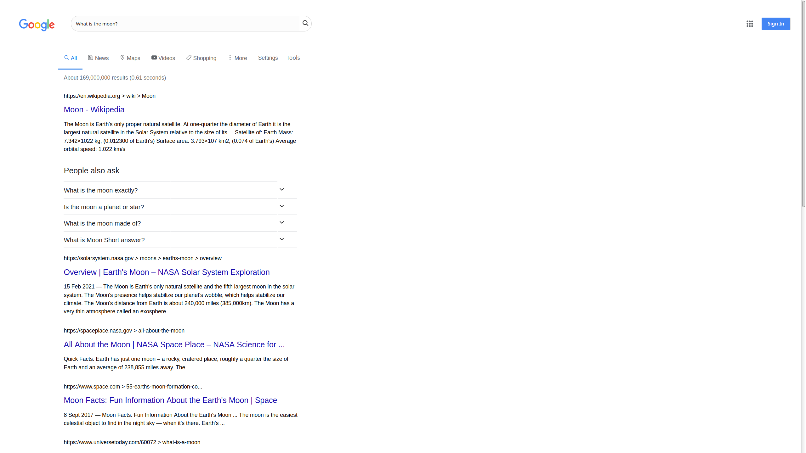
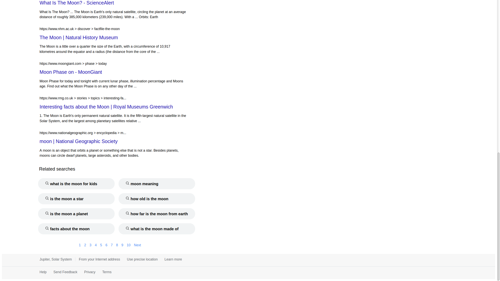

Google Search Result Page

In this project I will use HTML/CSS to (visually) replicate a Google Search result page. 
Below are screenshots of the outcome.

 
The live preview of this page is <a href="https://ravip14.github.io/google-search-result-page/">here</a>.